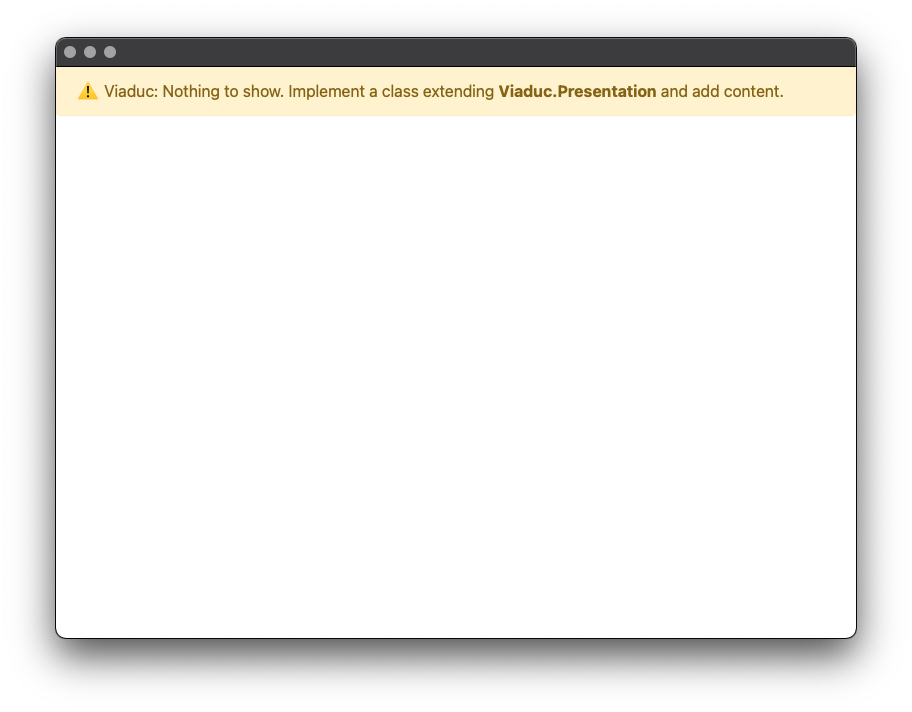
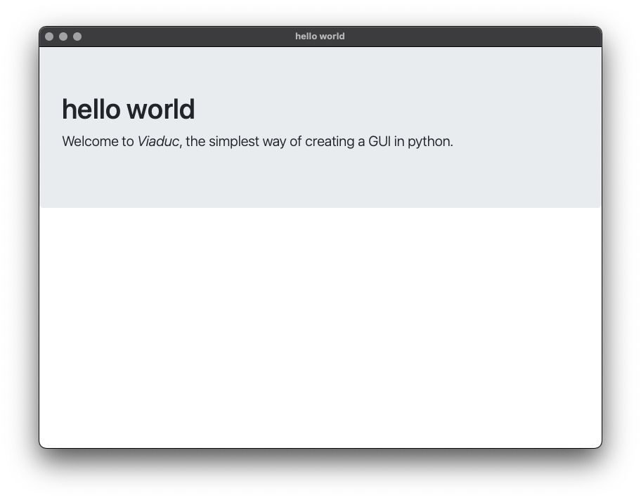
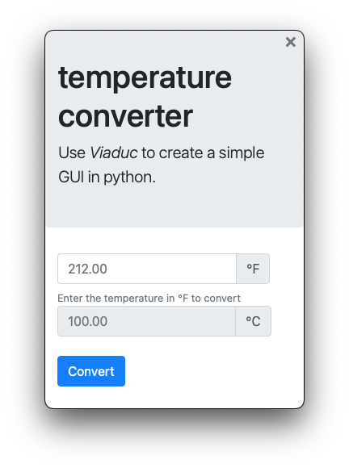
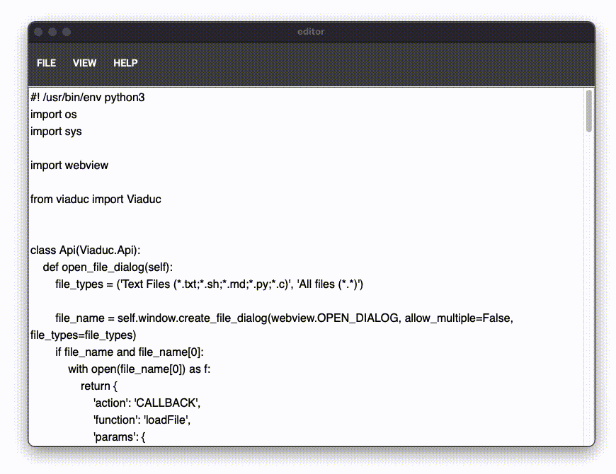
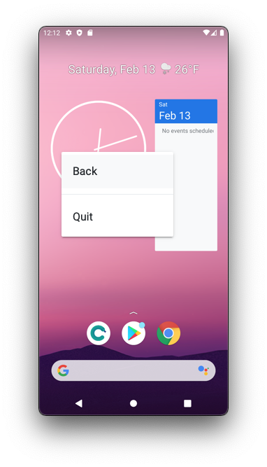
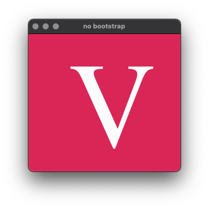

# viaduc

[](https://badge.fury.io/py/viaduc)

Viaduc is probably the simplest way to create a nice-looking gui using python and a tiny bit of html/css/js. No server and everything in one file.


See the code for this example [here](./examples/form.py).

**viaduc** uses pywebview and [Bootstrap](https://getbootstrap.com/) to provide a gui for other tools and scripts.

# install
```
$ pip install viaduc
```

# simplest
The simplest Viaduc program instantiates a `Viaduc` object, like this ([simplest.py](./examples/simplest.py))

```
#! /usr/bin/env python3

from viaduc import Viaduc

if __name__ == '__main__':
    Viaduc()
```

and you will see this window



# helloworld
Then, let's do something more interesting implementing the `Presentation` class.
Let's add a `title` and some `html` which includes some metatags (`{{name}}`) that are replaced by viaduc ([helloworld.py](./examples/helloworld.py)).

```
#! /usr/bin/env python3

from viaduc import Viaduc


class Presentation(Viaduc.Presentation):
    title = 'hello world'
    html = '''
<!DOCTYPE html>
<html lang="en">
  <head>
    {{bootstrap_meta}}

    {{bootstrap_css}}

    <title>{{title}}</title>
  </head>
  <body>
    <div class="jumbotron">
        <h1>{{title}}</h1>
        <p class="lead">Welcome to <em>Viaduc</em>, the simplest way of creating a GUI in python.</p>
    </div>
    
    {{bootstrap_js}}

  </body>  
 </html>
'''


if __name__ == '__main__':
    Viaduc(presentation=Presentation())
```

and we will obtain this




# temperature converter
We have seen how `Presentation` can implement the GUI, but what about the interaction?
([temperature-converter.py](./examples/temperature-converter.py))

```
#! /usr/bin/env python3
import sys

from viaduc import Viaduc


def fahrenheit_to_celsius(fahrenheit):
    return round((5 / 9) * (float(fahrenheit) - 32), 2)


class Api(Viaduc.Api):
    def convert(self, vals):
        v = self.map_vals(vals)
        if not v['_fahrenheit']:
            raise ValueError('Enter a temperature')
        return Viaduc.callback('showCelsius', {'celsius': fahrenheit_to_celsius(v['_fahrenheit'])})


class Presentation(Viaduc.Presentation):
    width = 320
    height = 468
    title = 'temperature converter'
    html = '''
    <!-- copy file here -->
    '''
    file = "temperature-converter.html"


if __name__ == '__main__':
    Viaduc(api=Api(), presentation=Presentation(), args=sys.argv + ['--frameless'])
```


Here we are also implementing API, which provides the means of interoperation between domains.

Another thing to note here is that instead of having the HTML as a string, we read it from a file to keep this example file smaller and focus on the essential parts.

When we execute it, we obtain this window. It's `frameless` as we are passing this extra argument to `Viaduc`.




Clicking the **Convert** button or pressing **RETURN** converts Fahrenheit's temperature to Celsius, invoking the `convert()` method. Viaduc automatically adds all the form values as `vals` that contain `id`s and `values`.

Once we convert the temperature using `fahrenheit_to_celsius()` we use the `CALLBACK` action to invoke a javascript method defined in [temperature-converter.html](./examples/temperature-converter.html#L65) to show the result.

# editor
We can also interact with the local filesystem reading and writing files. This [editor](./examples/editor.py) shows these interactions.

Also shows how to use [Bootstrap Material Design](https://mdbootstrap.github.io/bootstrap-material-design/).



# android-device-viewer
A more involved and practical example. [android-device-viewer](./examples/android-device-viewer.py) shows how easy is to provide a GUI and some interaction to other apps.



Using [Culebratester2-public](https://github.com/dtmilano/CulebraTester2-public) and the python client library [Culebratester2-client](https://github.com/dtmilano/CulebraTester2-client) communicates with an Android device to get the screenshot and send events (i.e. clicks). Therefore, you can interact with the physical device through its representation.

Also provides a context menu to be able to send BACK or quit the app.

# no bootstrap
Im case you don't need or want **bootstrap** to be included you can pass the option `--no-bootstrap` and **viaduc** won't
complain if the components are missing.

```
Viaduc(presentation=Presentation(), args=sys.argv + ['--no-bootstrap'])
```

See [no-bootstrap.py](./examples/no-bootstrap.py).



